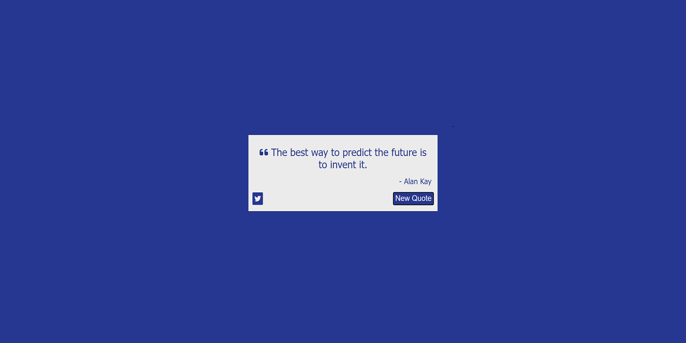

# random-quote-machine

This is a web application built in vanilla JavaScript that displays a random quote. The user can click on a button to generate a random new quote and change the background color to a random color. The user can also click the twitter icon to tweet the quote on Twitter.

## Preview

### Picture

### [GitHub Page](https://evanahdout.github.io/random-quote-machine/)
